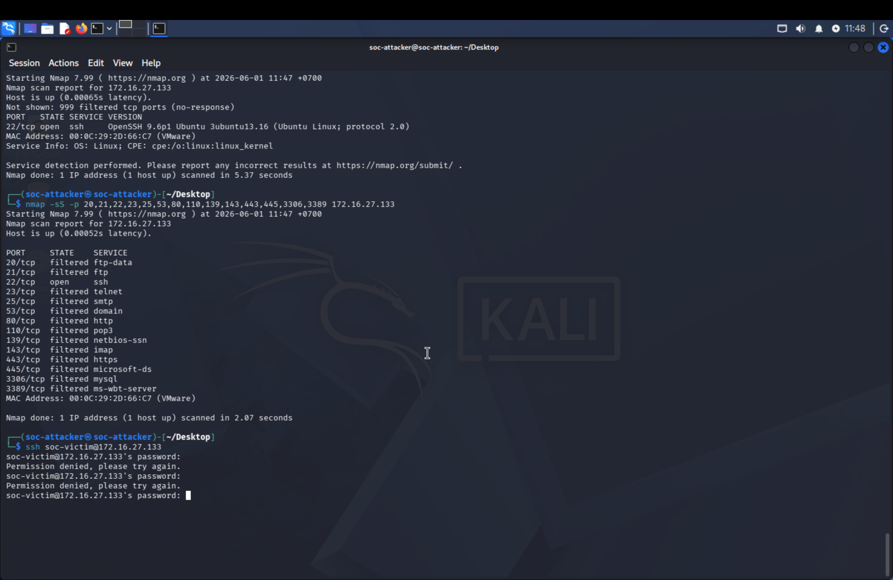
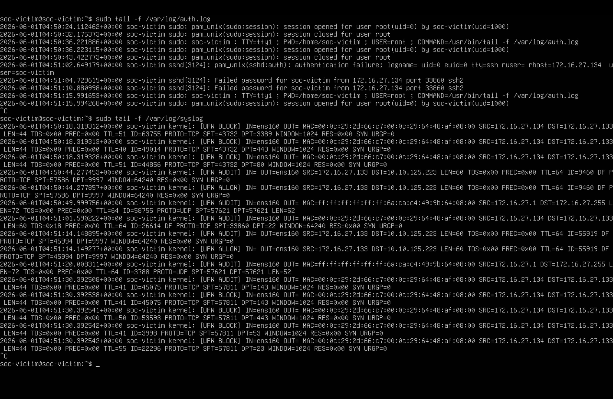
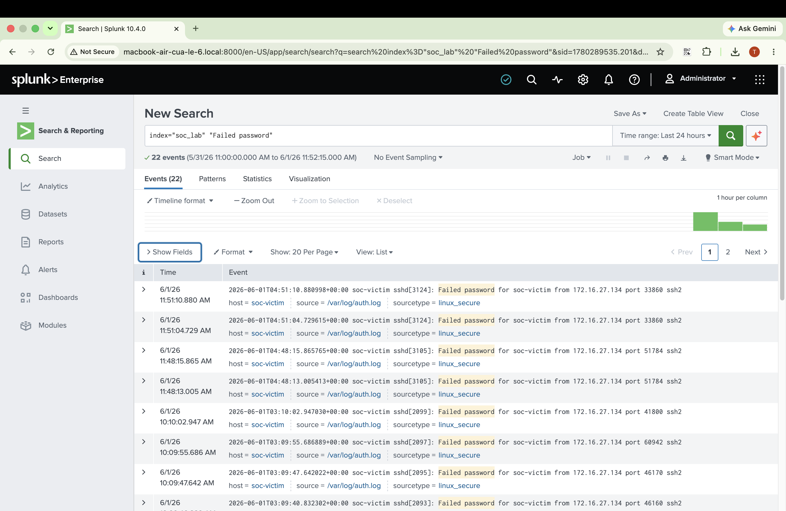
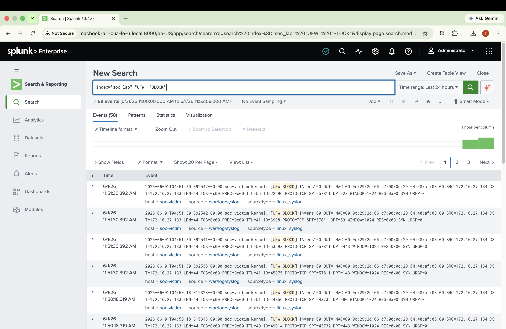
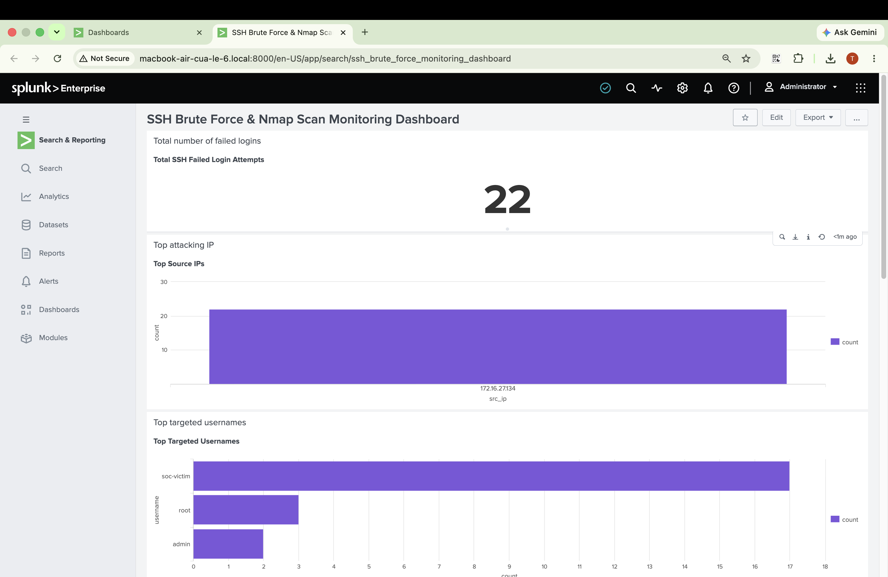
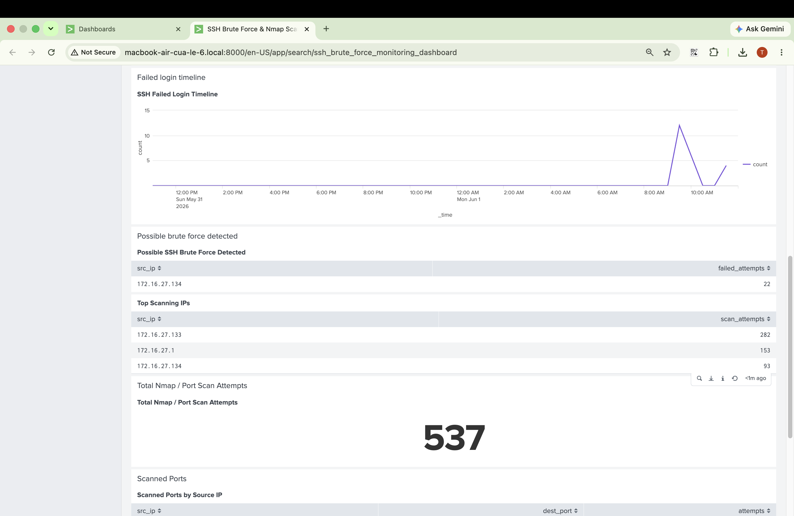
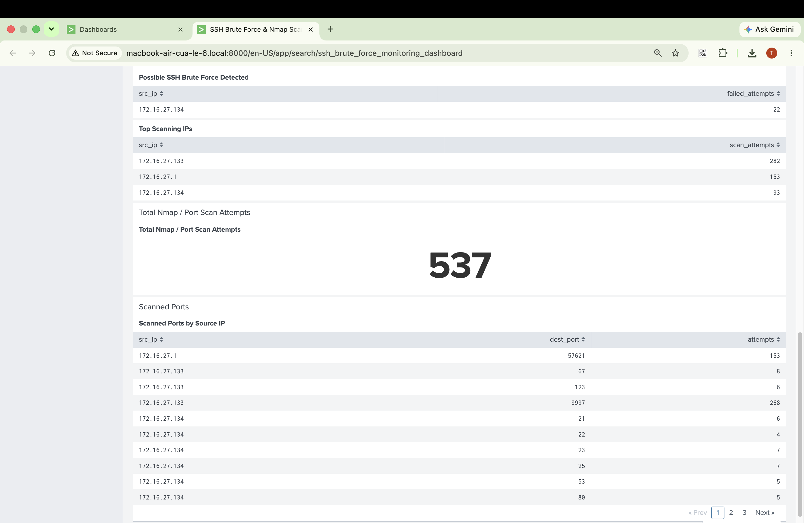
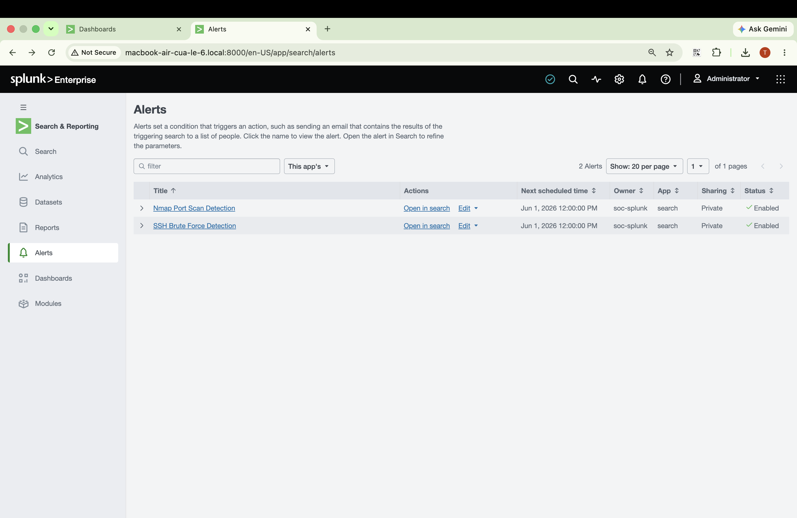
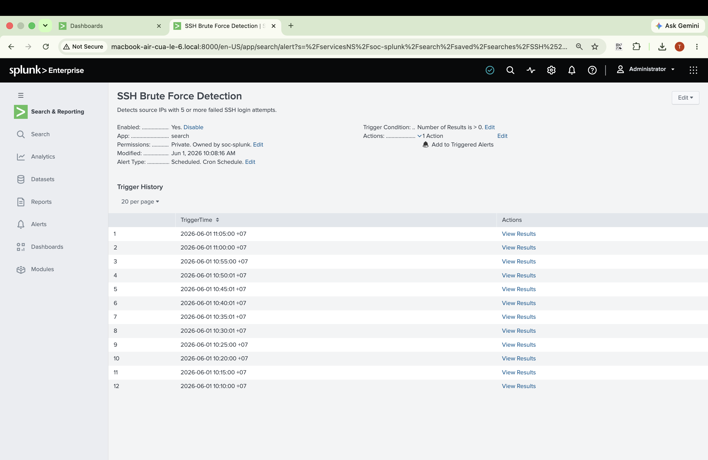
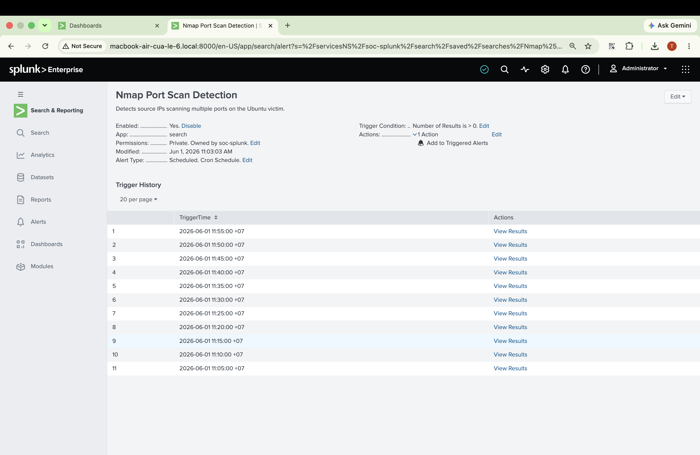

# SOC Home Lab: SSH Brute Force and Nmap Port Scan Detection with Splunk

## 1. Project Overview

This project demonstrates a basic SOC home lab for detecting suspicious activity using Splunk Enterprise.

The lab simulates two common attacker behaviors:

1. Nmap port scanning from Kali Linux.
2. SSH failed login attempts against an Ubuntu victim machine.

Logs from the Ubuntu victim were collected and forwarded to Splunk Enterprise for searching, alerting, and dashboard visualization.

---

## 2. Lab Topology

```text
Kali Attacker
172.16.27.134
    |
    | Nmap scan
    | SSH failed login attempts
    v
Ubuntu Victim
172.16.27.133
    |
    | /var/log/auth.log
    | /var/log/syslog
    | Splunk Universal Forwarder
    v
Splunk Enterprise
10.10.125.223
    |
    | SPL Queries
    | Alerts
    | Dashboard
    v
SOC Analyst Investigation
```

---

## 3. Machines Used

| Machine | Hostname | IP Address | Role |
|---|---|---:|---|
| Splunk Enterprise | soc-splunk | 10.10.125.223 | SIEM server |
| Ubuntu Victim | soc-victim | 172.16.27.133 | Target machine and log source |
| Kali Linux | soc-attacker | 172.16.27.134 | Attacker machine |

---

## 4. Tools Used

- Splunk Enterprise 10.4.0
- Splunk Universal Forwarder
- Ubuntu Server
- Kali Linux
- OpenSSH Server
- Nmap
- UFW Firewall
- SPL - Search Processing Language
- Linux logs:
  - `/var/log/auth.log`
  - `/var/log/syslog`

---

## 5. Objective

The objective of this project is to build a small SOC lab that can:

- Collect Linux authentication logs.
- Collect firewall logs from UFW.
- Simulate attacker reconnaissance using Nmap.
- Simulate SSH failed login attempts.
- Detect SSH brute-force behavior using Splunk SPL.
- Detect possible port scanning behavior using firewall logs.
- Build a Splunk dashboard for monitoring.
- Create Splunk alerts for suspicious activity.

---

## 6. Splunk Enterprise Configuration

Splunk Enterprise was used as the central SIEM platform.

Splunk Web was accessed from:

```text
http://10.10.125.223:8000
```

The Splunk index used in this project was:

```text
soc_lab
```

The victim machine forwarded logs to Splunk using Splunk Universal Forwarder.

---

## 7. Ubuntu Victim Log Sources

The Ubuntu victim generated two main types of logs.

### 7.1 SSH Authentication Logs

SSH authentication logs were stored in:

```text
/var/log/auth.log
```

These logs contained SSH failed login events such as:

```text
Failed password for soc-victim from 172.16.27.134
```

The attacker IP observed in the authentication logs was:

```text
172.16.27.134
```

### 7.2 UFW Firewall Logs

Firewall logs were stored in:

```text
/var/log/syslog
```

The logs contained UFW events such as:

```text
[UFW BLOCK]
[UFW AUDIT]
[UFW ALLOW]
```

These logs were used to identify possible port scanning activity from the attacker machine.

---

## 8. Attack Simulation

## 8.1 Nmap Port Scanning

Nmap was used from the Kali attacker machine to scan the Ubuntu victim.

Attacker machine:

```text
172.16.27.134
```

Victim machine:

```text
172.16.27.133
```

Nmap command used:

```bash
nmap -sV 172.16.27.133
```

The scan discovered that SSH was open on the victim:

```text
22/tcp open ssh OpenSSH 9.6p1 Ubuntu
```

A second Nmap scan was also performed against selected ports:

```bash
nmap -sS -p 20,21,22,23,25,53,80,110,139,143,443,445,3306,3389 172.16.27.133
```

The scan showed that port 22 was open and many other ports were filtered:

```text
22/tcp open ssh
20/tcp filtered ftp-data
21/tcp filtered ftp
23/tcp filtered telnet
25/tcp filtered smtp
53/tcp filtered domain
80/tcp filtered http
443/tcp filtered https
3306/tcp filtered mysql
3389/tcp filtered ms-wbt-server
```

This simulates the reconnaissance phase of an attack, where an attacker scans a target to discover open ports and running services.

---

## 8.2 SSH Failed Login Attempts

After discovering that SSH was open, SSH login attempts were performed from Kali Linux to the Ubuntu victim.

Command used from Kali:

```bash
ssh soc-victim@172.16.27.133
```

Wrong passwords were entered multiple times to generate failed authentication logs.

Example output from Kali:

```text
Permission denied, please try again.
Permission denied, please try again.
```

The Ubuntu victim generated SSH failed login logs in `/var/log/auth.log`.

Example event:

```text
Failed password for soc-victim from 172.16.27.134 port 33860 ssh2
```

---

## 9. Splunk Search Results

## 9.1 SSH Failed Login Search

Splunk successfully received SSH failed login logs from the Ubuntu victim.

Search query:

```spl
index="soc_lab" "Failed password"
```

Result:

```text
22 events
```

Example event:

```text
soc-victim sshd[3124]: Failed password for soc-victim from 172.16.27.134 port 33860 ssh2
```

Important fields observed:

| Field | Value |
|---|---|
| host | soc-victim |
| source | /var/log/auth.log |
| sourcetype | linux_secure |
| attacker IP | 172.16.27.134 |

---

## 9.2 UFW Firewall Log Search

Splunk also received UFW firewall logs from the Ubuntu victim.

Search query:

```spl
index="soc_lab" "UFW" "BLOCK"
```

Result:

```text
58 events
```

Example event:

```text
soc-victim kernel: [UFW BLOCK] IN=ens160 SRC=172.16.27.134 DST=172.16.27.133 PROTO=TCP DPT=23
```

Important fields observed:

| Field | Value |
|---|---|
| host | soc-victim |
| source | /var/log/syslog |
| sourcetype | linux_syslog |
| source IP | 172.16.27.134 |
| destination IP | 172.16.27.133 |

---

## 10. SPL Detection Queries

## 10.1 Total SSH Failed Login Attempts

```spl
index="soc_lab" "Failed password"
| stats count as failed_login_count
```

Purpose:

```text
Counts total SSH failed login attempts.
```

Observed result:

```text
22 failed login attempts
```

---

## 10.2 Top Attacking IPs for SSH Failed Logins

```spl
index="soc_lab" "Failed password"
| rex "from (?<src_ip>\d{1,3}(?:\.\d{1,3}){3})"
| stats count by src_ip
| sort - count
```

Observed result:

| src_ip | count |
|---|---:|
| 172.16.27.134 | 22 |

---

## 10.3 Top Targeted Usernames

```spl
index="soc_lab" "Failed password"
| rex "Failed password for (?<username>\S+) from"
| stats count by username
| sort - count
```

Observed usernames:

| username | count |
|---|---:|
| soc-victim | 17 |
| root | 3 |
| admin | 2 |

---

## 10.4 SSH Failed Login Timeline

```spl
index="soc_lab" "Failed password"
| timechart count
```

Purpose:

```text
Shows SSH failed login activity over time.
```

---

## 10.5 Possible SSH Brute Force Detection

```spl
index="soc_lab" "Failed password"
| rex "from (?<src_ip>\d{1,3}(?:\.\d{1,3}){3})"
| stats count as failed_attempts by src_ip
| where failed_attempts >= 5
| sort - failed_attempts
```

Observed result:

| src_ip | failed_attempts |
|---|---:|
| 172.16.27.134 | 22 |

This indicates possible SSH brute-force activity from the Kali attacker machine.

---

## 10.6 Top Scanning IPs from UFW Logs

```spl
index="soc_lab" "UFW"
| rex "SRC=(?<src_ip>\d{1,3}(?:\.\d{1,3}){3})"
| stats count as scan_attempts by src_ip
| sort - scan_attempts
```

Observed result:

| src_ip | scan_attempts |
|---|---:|
| 172.16.27.133 | 282 |
| 172.16.27.1 | 153 |
| 172.16.27.134 | 93 |

---

## 10.7 Total Nmap / Port Scan Attempts

```spl
index="soc_lab" "UFW"
| stats count as total_port_scan_attempts
```

Observed result:

```text
537 total Nmap / port scan attempts
```

---

## 10.8 Scanned Ports by Source IP

```spl
index="soc_lab" "UFW"
| rex "SRC=(?<src_ip>\d{1,3}(?:\.\d{1,3}){3})"
| rex "DPT=(?<dest_port>\d+)"
| stats count as attempts by src_ip, dest_port
| sort - attempts
```

Observed scanned ports included:

| src_ip | dest_port | attempts |
|---|---:|---:|
| 172.16.27.1 | 57621 | 153 |
| 172.16.27.133 | 9997 | 268 |
| 172.16.27.134 | 21 | 6 |
| 172.16.27.134 | 22 | 4 |
| 172.16.27.134 | 23 | 7 |
| 172.16.27.134 | 25 | 7 |
| 172.16.27.134 | 53 | 5 |
| 172.16.27.134 | 80 | 5 |

---

## 11. Splunk Dashboard

A Splunk dashboard was created to monitor SSH brute-force and Nmap/port scanning activity.

Dashboard name:

```text
SSH Brute Force & Nmap Scan Monitoring Dashboard
```

Dashboard panels:

| Panel | Visualization | Purpose |
|---|---|---|
| Total SSH Failed Login Attempts | Single Value | Shows total SSH failed logins |
| Top Source IPs | Column Chart | Shows top IPs causing failed SSH logins |
| Top Targeted Usernames | Bar Chart | Shows usernames targeted in SSH attempts |
| SSH Failed Login Timeline | Line Chart | Shows failed login activity over time |
| Possible SSH Brute Force Detected | Statistics Table | Shows IPs with 5+ failed SSH login attempts |
| Top Scanning IPs | Statistics Table | Shows IPs generating UFW scan/block logs |
| Total Nmap / Port Scan Attempts | Single Value | Shows total firewall events related to scan attempts |
| Scanned Ports by Source IP | Statistics Table | Shows destination ports scanned by each source IP |

---

## 12. Splunk Alerts

Two Splunk alerts were created.

---

## 12.1 SSH Brute Force Detection Alert

Alert name:

```text
SSH Brute Force Detection
```

Description:

```text
Detects source IPs with 5 or more failed SSH login attempts.
```

Alert query:

```spl
index="soc_lab" "Failed password"
| rex "from (?<src_ip>\d{1,3}(?:\.\d{1,3}){3})"
| stats count as failed_attempts by src_ip
| where failed_attempts >= 5
| sort - failed_attempts
```

Trigger condition:

```text
Number of Results > 0
```

Action:

```text
Add to Triggered Alerts
```

Status:

```text
Enabled
```

---

## 12.2 Nmap Port Scan Detection Alert

Alert name:

```text
Nmap Port Scan Detection
```

Description:

```text
Detects source IPs scanning multiple ports on the Ubuntu victim.
```

Alert query:

```spl
index="soc_lab" "UFW"
| rex "SRC=(?<src_ip>\d{1,3}(?:\.\d{1,3}){3})"
| rex "DPT=(?<dest_port>\d+)"
| stats dc(dest_port) as unique_ports count as total_attempts by src_ip
| where unique_ports >= 5
| sort - unique_ports
```

Trigger condition:

```text
Number of Results > 0
```

Action:

```text
Add to Triggered Alerts
```

Status:

```text
Enabled
```

---

## 13. Findings

During the simulation, the Kali attacker machine `172.16.27.134` performed reconnaissance against the Ubuntu victim `172.16.27.133` using Nmap.

The Nmap scan discovered that SSH port 22 was open on the victim machine. After that, multiple SSH login attempts were performed against the victim using wrong passwords.

The Ubuntu victim generated authentication logs in `/var/log/auth.log`, including failed SSH login events from `172.16.27.134`.

The victim also generated UFW firewall logs in `/var/log/syslog`, including blocked and audited TCP connection attempts related to scanning activity.

Splunk successfully ingested these logs into the `soc_lab` index and was able to detect:

- SSH failed login attempts.
- Possible SSH brute-force behavior.
- Top attacking source IP.
- Targeted usernames.
- Nmap/port scanning behavior.
- Scanned destination ports.
- Firewall block events.

---

## 14. Screenshots

The following screenshots demonstrate the lab setup, attack simulation, Splunk searches, dashboard, and alerts.

### Nmap Scan Result


### Victim Authentication and Firewall Logs


### Splunk Failed Password Search


### Splunk UFW Block Search


### Splunk Dashboard Overview (Part 1)


### Splunk Dashboard Overview (Part 2)


### Splunk Dashboard Overview (Part 3)


### Alerts List


### SSH Brute Force Alert


### Nmap Port Scan Alert


---

## 15. What I Learned

Through this project, I learned how to:

- Build a basic SOC home lab.
- Use Kali Linux as an attacker machine.
- Use Nmap to perform port scanning.
- Identify open SSH services on a target.
- Generate SSH failed login logs.
- Read Linux authentication logs from `/var/log/auth.log`.
- Read UFW firewall logs from `/var/log/syslog`.
- Configure Splunk to ingest Linux security logs.
- Write SPL queries for detection.
- Extract source IPs and destination ports using `rex`.
- Create Splunk dashboards.
- Create Splunk alerts.
- Investigate suspicious SSH and port scanning activity like a SOC analyst.

---

## 16. Skills Demonstrated

- SIEM log analysis
- Splunk Enterprise
- Splunk Universal Forwarder
- SPL query writing
- Linux log analysis
- SSH brute-force detection
- Nmap reconnaissance
- UFW firewall log analysis
- Dashboard creation
- Alert creation
- Basic SOC investigation

---

## 17. CV Summary

```text
Built a Splunk-based SOC home lab using Kali Linux, Ubuntu Server, Nmap, and Splunk Enterprise to detect SSH brute-force attempts and Nmap port scanning activity. Configured Linux log forwarding, wrote SPL detection queries, created dashboards, and implemented alerts for suspicious authentication and scanning behavior.
```
